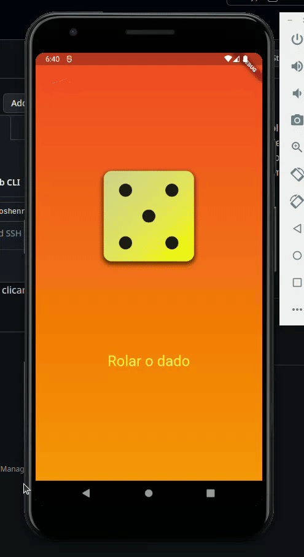

# Dado-de-seis-lados
Este projeto é a primeira aplicação prática do uso de estados de um Widget, assim, ao clicar no botão o estado do widget do Dado muda em tempo real.

Conceitos aplicados:
-> Stateful Widget
-> Gradient para fazer o degradê(pode ser alterado para um degradê azul/roxo que foi definido)
-> Scaffold para suportar a árvore de Widgets
-> MaterialApp para configurar o background
-> Column
-> Center
-> Herança
-> Métodos construtores
-> Parâmetros nominais predefinidos na biblioteca Material.dart
-> Uso de Imagens
